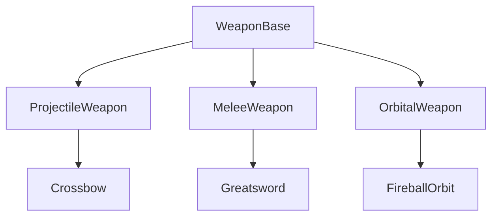

# Weapon System

**Location:** `Gameplay/Weapons/`

## Architecture
*   `WeaponBase` (Abstract): Handles Cooldowns, Stats, and Event Firing.
*   `WeaponData` (ScriptableObject): Stores Damage, Speed, and Prefab refs.

## Inheritance

## Adding a New Weapon
1.  Create `NewWeapon.cs` inheriting from `WeaponBase`.
2.  Implement `Fire()` method.
3.  Create `WeaponData` asset in `Resources/Data`.
4.  Expose `public Data.WeaponData Data => weaponData;` (Standard).
