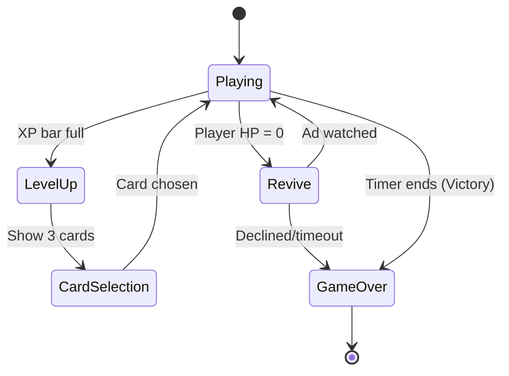

# GDD - GameScene Technical Design
**Parent:** [Main Game Design Document](file:///c:/Users/Honor/Unity%20Games/Pixel%20Vanguard/Documents/Game%20Design%20Document%20-%20Main.md)

---

## GameScene Overview

The **GameScene** is the heart of Pixel Vanguard. It is where the core gameplay loop executes: combat, progression, and survival.

---

## Scene Hierarchy Structure

```
GameScene (Scene Root)
│
├── 📁 Environment
│   └── InfiniteTileMap (Repeating ground texture)
│
├── 📁 GameplayLayer (Y-Sort Enabled)
│   ├── Player (CharacterBody2D + Sprite + Camera)
│   ├── EnemiesContainer (Holds all active enemies)
│   ├── ProjectilesContainer (Bullets, arrows, etc.)
│   ├── XPGemsContainer (Loot drops)
│   └── FloatingTextManager (Damage numbers)
│
├── 📁 Managers (No visuals, pure logic)
│   ├── GameManager
│   ├── EnemySpawner
│   ├── Director (Difficulty scaling)
│   ├── WeaponManager
│   └── LevelUpManager
│
└── 📁 UI (Canvas)
    ├── HUD (HP, XP, Timer, Kill count)
    ├── LevelUpPanel (3 cards, hidden by default)
    ├── PauseMenu (Overlay)
    └── ReviveScreen (Overlay)
```

---

## Gameplay Flow Explained

### Phase 1: Game Start

1. **GameManager** calls `StartGame()`
2. **Player** spawns at center (0, 0) with starter weapon
3. **Director** begins time tracking (00:00)
4. **EnemySpawner** starts spawn timer
5. **Camera** follows player smoothly

### Phase 2: Core Loop



#### Player Actions (Every Frame)
- **Movement**: Input → Velocity calculation → Move CharacterBody2D
- **Camera**: Smoothly follow player position
- **Weapon Auto-Fire**: Each equipped weapon fires independently based on cooldown

#### Enemy Behavior (Every Frame)
- **Pathfinding**: Move toward player (simple vector direction)
- **Collision**: If touching player → deal contact damage
- **Hit Reaction**: When damaged → knockback physics + flash sprite

#### Loot System
- **XP Gems**: On enemy death → spawn at death position → float toward player (magnet radius)
- **Gold Coins**: Same as XP, but contribute to end-game gold instead of XP bar
- **Health Potions**: Rare drops, instant healing on collection

---

## Key Systems Deep Dive

### 1. Enemy Spawning System

**Script:** `EnemySpawner.cs`

**Spawning Rules:**
- Enemies spawn at the **edges of the camera view** (off-screen)
- Spawn rate increases over time based on difficulty curve
- Enemy types weighted by current game time

**Example Difficulty Curve:**

| Game Time | Enemies/Wave | Types |
|-----------|--------------|-------|
| 0:00-1:00 | 10-15 | Skeleton only |
| 1:00-3:00 | 20-30 | Skeleton + Crawler |
| 3:00-5:00 | 30-50 | All types |
| 5:00+ | 50-100 | All types + Boss every 2 min |

**Implementation Details:**
```
Every N seconds (based on difficulty):
1. Pick random spawn position at screen edge
2. Select enemy type from weighted pool
3. Instantiate enemy prefab
4. Add to EnemiesContainer
5. Enemy AI activates (move toward player)
```

### 2. Weapon System Architecture

**Script:** `WeaponManager.cs`, `WeaponBase.cs`

**Weapon Lifecycle:**
```
Player levels up → Selects weapon card → WeaponManager.EquipWeapon() → 
Weapon instance added to equipped list → Weapon.StartAutoFire()
```

**Weapon Types & Behavior:**

#### A. Orbiting Melee (Greatsword)
- **Visual**: Sprite rotates around player in circle
- **Hit Detection**: Uses Area2D rotating with sprite
- **Upgrade**: Increases rotation speed + hitbox size

#### B. Projectile (Crossbow)
- **Auto-Fire**: Every X seconds, spawn arrow toward nearest enemy
- **Projectile**: Moves in straight line, pierces N enemies (upgradeable)
- **Upgrade**: Multi-shot (1→2→3 arrows), increased pierce

#### C. Area Denial (Molotov)
- **Auto-Fire**: Throw flask at random position near player
- **Effect**: Creates damaging zone (Area2D) that persists for Y seconds
- **Upgrade**: Larger radius, longer duration

#### D. Orbital Shield (Magic Orbitals)
- **Visual**: Orbs rotate around player similar to greatsword
- **Behavior**: Blocks enemy projectiles, damages on contact
- **Upgrade**: Add more orbs (1→2→3)

**Damage Calculation:**
```
Final Damage = (Weapon Base Damage × Weapon Level Multiplier) × Player Might Stat × (Crit Chance ? 2 : 1)
```

### 3. Level Up System

**Script:** `LevelUpManager.cs`

**XP Tracking:**
- Each enemy drops XP gems (amount varies by enemy type)
- Player collects gems → XP added to current level progress
- When XP >= threshold → level up event fired

**XP Curve:**
```
Level 1→2: 100 XP
Level 2→3: 150 XP
Level 3→4: 225 XP
(Increases by ~50% each level)
```

**Card Generation Algorithm:**
```
On Level Up:
1. Pause game (Time.timeScale = 0)
2. Generate card pool:
   - If player has < 4 weapons: Include random new weapon cards
   - If player has weapons: Include upgrade cards for each weapon
   - Always include 2-3 stat boost cards (Might, Speed, etc.)
3. Randomly select 3 cards from pool (no duplicates)
4. Display cards in UI
5. Wait for player click
6. Apply selected upgrade
7. Resume game (Time.timeScale = 1)
```

**Reroll System (Ad Integration):**
- Small button below cards: "Watch Ad to Reroll"
- If clicked: Show rewarded ad → regenerate 3 new cards

### 4. Combat & Physics

**Damage Dealing:**
```
Weapon hitbox/projectile → Enters enemy Area2D → 
EnemyHealth.TakeDamage(amount) → 
Calculate knockback direction → Apply impulse → 
Spawn floating damage text → 
If HP <= 0: PlayDeathAnimation() + spawn loot + destroy
```

**Knockback Formula:**
```
Knockback Direction = (Enemy Position - Hit Source Position).Normalized
Knockback Force = Weapon Knockback Stat × (1 - Enemy Weight Resistance)
Enemy Velocity += Knockback Direction × Knockback Force
```

This creates the "pushing through a horde" feel - lightweight enemies fly back, heavy enemies barely budge.

**Y-Sorting:**
- All sprites in GameplayLayer have `Y Sort Enabled = true`
- Unity automatically renders sprites with lower Y positions on top
- Creates 2.5D depth illusion (player below enemy = player rendered on top)

### 5. Camera System

**Script:** `CameraController.cs`

**Behavior:**
- **Target**: Player position
- **Smoothing**: Lerp with damping (not instant follow)
- **Bounds**: No bounds (infinite map)
- **Zoom**: Fixed (but can change based on screen size during Bootstrap)

**Implementation:**
```csharp
void LateUpdate() {
    Vector3 targetPos = new Vector3(player.position.x, player.position.y, -10f);
    transform.position = Vector3.Lerp(transform.position, targetPos, smoothSpeed * Time.deltaTime);
}
```

---

## State Management

**GameManager States:**

| State | Description | Entry Condition | Exit Condition |
|-------|-------------|-----------------|----------------|
| `Initializing` | Loading player data, spawning player | Scene start | Player spawned |
| `Playing` | Active combat | Init complete | XP full OR player dead OR time limit |
| `LevelUp` | Game paused, cards shown | XP threshold reached | Card selected |
| `Paused` | Pause menu open | Pause button clicked | Resume clicked |
| `Reviving` | Revive screen shown, countdown active | Player HP = 0 (first time) | Ad watched OR declined |
| `GameOver` | Run complete | Timer ends OR player declined revive | Scene transition |

**State Transitions:**
- Only allowed transitions are defined (no Playing→Revive if already revived)
- UI elements activate/deactivate based on state
- Time.timeScale controlled: Playing/Paused affect game physics

---

## Performance Considerations

### Object Pooling

**Critical for:** Enemies, projectiles, XP gems, damage text

**Why:** Spawning hundreds of enemies per minute causes GC spikes

**Implementation:**
- `ObjectPool<T>` generic class
- Pre-instantiate pools during GameManager.Initialize()
- Deactivate instead of destroy, reactivate from pool

### Sprite Rendering

**Pre-rendered 3D Sprites:**
- All character animations rendered as sprite sheets offline
- Loaded as texture atlases to minimize draw calls
- Use SpriteAtlas to batch sprite rendering

### Enemy AI

**Simple Vector Math:**
```
Direction = (Player Position - Enemy Position).Normalized
Velocity = Direction × MoveSpeed
```
No pathfinding needed - straight line toward player is sufficient.

---

## UI Integration

### HUD Updates

**HP Bar:**
- Listens to `PlayerHealth.OnHealthChanged` event
- Updates fill amount: `fillAmount = currentHP / maxHP`

**XP Bar:**
- Listens to `LevelUpManager.OnXPChanged` event
- Animated fill with lerp for satisfying visual

**Timer:**
- Reads from `Director.CurrentGameTime`
- Updates every second (not every frame)

**Kill Counter:**
- Listens to `EnemyHealth.OnEnemyKilled` event (static)
- Increments counter, updates text

### Level Up Panel

**Card Display:**
- Each card is a prefab with icon, title, description
- Cards instantiated from pool, populated with data
- Click handler calls `LevelUpManager.OnCardSelected(cardData)`

---

## Debug & Testing Hooks

**Inspector Controls (GameManager):**
- `[Dev] Force Level Up` button
- `[Dev] Spawn Enemy Type` dropdown
- `[Dev] Grant Gold` field
- `[Dev] God Mode Toggle`

**Cheats (Console Commands):**
- `weapons.unlock_all` - Get all weapons maxed
- `player.invincible true` - Toggle god mode
- `time.speed 2` - Double time scale

---

## Future Expansion Points

- **Boss Wave System**: Director triggers special spawn patterns
- **Environmental Hazards**: Lava pools, spike traps in map
- **Power-Up Drops**: Temporary buffs (double damage for 10s)
- **Combo System**: Chain kills for multiplier bonus
