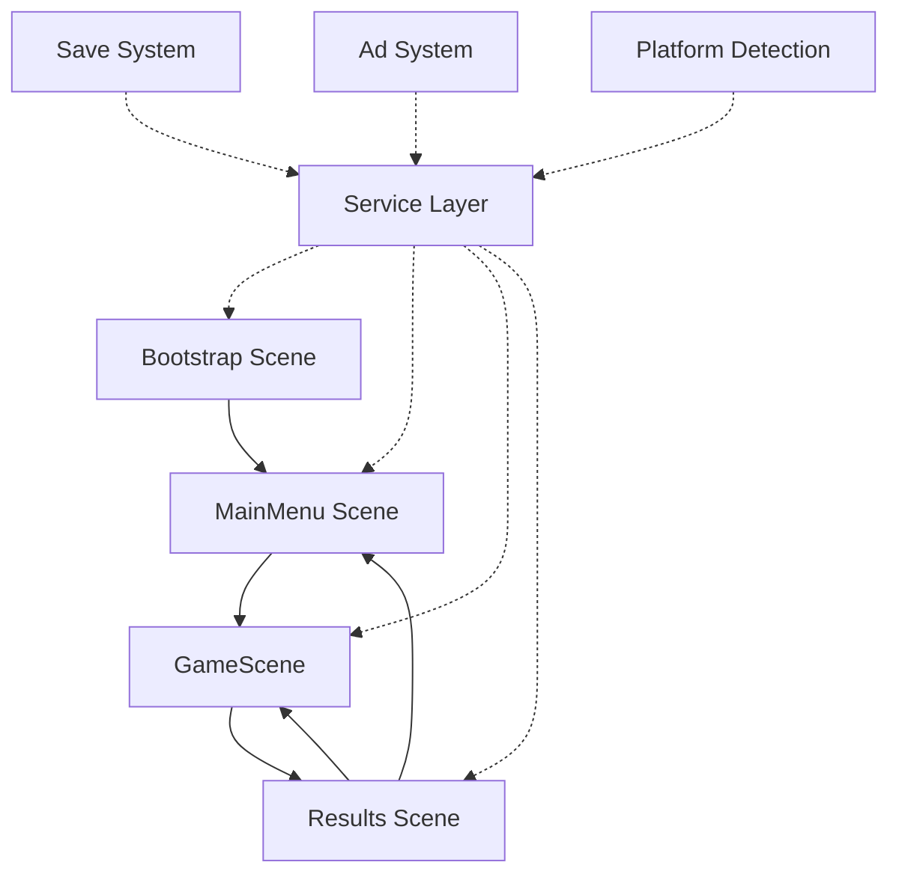
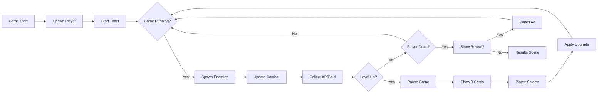

# Game Design Document - Pixel Vanguard
**Version:** 1.0  
**Last Updated:** 2025-12-10  
**Type:** Horde Survivor / Action Roguelite

---

## Table of Contents
1. [System Architecture Overview](#system-architecture-overview)
2. [Scene Flow & Navigation](#scene-flow--navigation)
3. [Core Systems](#core-systems)
4. [Reference Documents](#reference-documents)

---

## System Architecture Overview

### High-Level Architecture



### Core Pillars

1. **Platform Agnostic Design**: Single codebase supports Android, Web Desktop, and Web Mobile
2. **Service-Based Architecture**: Platform-specific services (Ads, Saves) are injected at runtime
3. **Data-Driven Gameplay**: Weapons, enemies, and stats defined via ScriptableObjects
4. **Event-Driven Communication**: Systems communicate via events to maintain loose coupling

---

## Scene Flow & Navigation

### Scene Hierarchy

```
Bootstrap (Initialization)
    ↓
MainMenu (Hub)
    ↓ (Play Button)
GameScene (Core Gameplay Loop)
    ↓ (Win/Loss)
Results (Summary + Monetization)
    ↓ (Home)           ↓ (Retry)
MainMenu          GameScene
```

### Scene Responsibilities

| Scene | Purpose | Key Scripts | Persistent? |
|-------|---------|-------------|-------------|
| **Bootstrap** | Platform detection, service injection, data loading | `Bootstrap`, `ServiceLocator`, `PlatformDetector` | No |
| **MainMenu** | Character selection, shop, navigation hub | `MainMenuController`, `ShopManager`, `CharacterSelector`   | No |
| **GameScene** | Combat, progression, level-up events | `GameManager`, `PlayerController`, `EnemySpawner`, `LevelUpManager` | No |
| **Results** | Game summary, ad monetization, save data | `ResultsController`, `AdRewardHandler`, `SaveWriter` | No |

---

## Core Systems

### 1. Service Locator Pattern

**Purpose:** Provide platform-specific implementations without hardcoding dependencies

**Location:** Global singleton, initialized in Bootstrap

**Key Interfaces:**
- `IAdService` - Ads (AdMob for Android, Yandex Ads for Web)
- `ISaveService` - Save data (PlayerPrefs for Android, Cloud for Yandex)
- `IPlatformService` - Input handling, screen orientation

**Implementation Flow:**
```
Bootstrap → Detect Platform → Register Services → Load Initial Data → Navigate to MainMenu
```

### 2. Game Loop Architecture

**Location:** GameScene

**Flow Diagram:**



**Key Managers:**
- **GameManager**: Master controller, owns game state (Paused/Running/GameOver)
- **EnemySpawner**: Time-based difficulty scaling, spawns enemies at screen edges
- **LevelUpManager**: XP tracking, card generation, upgrade application
- **WeaponManager**: Handles equipped weapons, auto-fire logic, collision detection

### 3. Combat System

**Damage Flow:**
```
Weapon (Auto-fires) → Projectile/Hitbox → Enemy Hit → Calculate Damage → Apply Knockback → Drop XP/Gold
```

**Key Components:**
- **Weapon Base Class**: Defines fire rate, damage multiplier, auto-fire behavior
- **Projectile**: Handles movement, pierce count, lifetime
- **Enemy Health**: Takes damage, handles knockback physics, spawns loot on death

**Y-Sorting:** All combat happens in a Y-sorted layer for proper 2.5D depth perception

### 4. Progression System

**Two Progression Tracks:**

#### A. In-Run Progression (Temporary)
- Level up from XP gems
- Unlock/upgrade weapons during run
- Temporary stat boosts
- **Reset on death/completion**

#### B. Meta Progression (Permanent)
- Gold earned from runs
- Purchase permanent stat upgrades (Vitality, Might, Greaves, Magnet, Luck)
- Unlock new characters
- **Persists across sessions**

**Data Flow:**
```
GameScene (Collect Gold) → Results Scene (Optionally Double with Ad) → Save System → MainMenu (Display Total)
```

### 5. Monetization Integration

**Ad Placements:**

| Type | Trigger | Reward | Implementation |
|------|---------|--------|----------------|
| **Rewarded** | Results screen "Double Gold" button | 2x gold | `IAdService.ShowRewardedAd()` |
| **Rewarded** | Level-up reroll button | New card selection | `LevelUpManager.OnRerollRequest()` |
| **Rewarded** | Revive screen | Restore 50% HP, continue run | `ReviveManager.OnReviveRequest()` |
| **Rewarded** | Shop "Daily Grant" | +500 gold | `ShopManager.OnDailyGrant()` |
| **Interstitial** | Post-results (frequency capped) | N/A | `IAdService.ShowInterstitial()` |

**Flow Example (Revive):**
```
Player HP = 0 → Pause Game → Check Revive Count → Show ReviveScreen → Player Clicks "Revive" → 
Show Ad → Wait for Ad Close → Heal Player (50%) → Grant Invincibility (3s) → Resume Game
```

---

## Reference Documents

Detailed technical designs for specific systems:

- [GameScene Technical Design](file:///c:/Users/Honor/Unity%20Games/Pixel%20Vanguard/Documents/GDD%20-%20GameScene%20Technical.md) - Deep dive into combat loop, spawning, and weapon systems
- [Service Architecture](file:///c:/Users/Honor/Unity%20Games/Pixel%20Vanguard/Documents/GDD%20-%20Service%20Architecture.md) - Platform detection and service injection patterns
- [Data Models Reference](file:///c:/Users/Honor/Unity%20Games/Pixel%20Vanguard/Documents/GDD%20-%20Data%20Models.md) - ScriptableObject schemas for weapons, enemies, characters

---

## Script Responsibilities Quick Reference

| Script | Scene | Purpose | Events Emitted | Events Listened |
|--------|-------|---------|----------------|-----------------|
| `Bootstrap` | Bootstrap | Initialize services, load save data | `OnServicesReady` | None |
| `GameManager` | GameScene | Master game state, pause/resume | `OnGameStart`, `OnGameOver`, `OnPause` | `OnPlayerDeath` |
| `PlayerController` | GameScene | Movement, health, input handling | `OnPlayerDeath`, `OnPlayerLevelUp` | `OnUpgradeApplied` |
| `EnemySpawner` | GameScene | Spawn enemies based on time/difficulty | None | `OnGameStart`, `OnPause` |
| `WeaponManager` | GameScene | Manage equipped weapons, auto-fire | `OnWeaponFired`, `OnEnemyHit` | `OnPlayerLevelUp` |
| `LevelUpManager` | GameScene | XP tracking, card generation | `OnLevelUp`, `OnCardsGenerated` | `OnCardSelected` |
| `ResultsController` | Results | Display stats, handle ad rewards | `OnGoldCalculated` | `OnAdWatched` |
| `ShopManager` | MainMenu | Purchase upgrades, unlock characters | `OnPurchaseComplete` | None |

---

## Design Principles

1. **Separation of Concerns**: Each manager handles ONE responsibility
2. **Event-Driven**: Avoid direct references between systems
3. **Data-Driven**: Game balance tweaked via ScriptableObjects, not code
4. **Platform Agnostic**: No platform-specific code outside service implementations
5. **Fail-Safe Ads**: Game must work even if ad service fails (graceful degradation)

---

## Future Expansion Points

- **Boss Waves**: Director can trigger special boss spawns at set times
- **New Weapons**: Drop-in via ScriptableObjects, no code changes needed
- **Daily Challenges**: Separate scene or GameScene mode variant
- **Leaderboards**: Add `ILeaderboardService` to service layer
