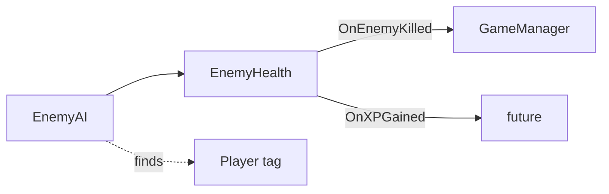

# Script Interactions

**How scripts communicate.**

---

## Core Flow

```
ServiceLocator (singleton, no deps)
GameEvents (static, no deps)
GameManager (listens to events, controls time)
```

---

## Player Systems


**Communication:**
- PlayerHealth fires events, doesn't call GameManager directly
- GameManager listens and reacts (pause game, end game)

---

## Enemy Systems



**Communication:**
- EnemyAI finds Player by tag (GameObject.FindGameObjectWithTag)
- EnemyHealth reads EnemyData.moveSpeed
- Events used for XP, gold, kill count

---

## Event Flow

**Player Death:**
1. `PlayerHealth.Die()` → fires `OnPlayerDeath`
2. `GameManager.OnPlayerDeath()` → calls `EndGame()`
3. `GameManager.EndGame()` → sets `Time.timeScale = 0`

**Enemy Death:**
1. `EnemyHealth.Die()` → fires `OnEnemyKilled`, `OnXPGained`, `OnGoldCollected`
2. `GameManager` updates kill count
3. (Future) LevelUpManager tracks XP

---

## Dependencies

| Script | Depends On |
|--------|-----------|
| PlayerController | Rigidbody2D, InputActions |
| PlayerHealth | PlayerController |
| EnemyAI | EnemyHealth, Player (tag) |
| EnemyHealth | Rigidbody2D, EnemyData |
| GameManager | GameEvents |

---

## Future Integrations

**When adding EnemySpawner:**
- Spawner calls `EnemyHealth.Initialize(EnemyData)`
- Spawner calls `EnemyAI.SetMoveSpeed(speed)`

**When adding Weapons:**
- Weapon finds enemies → calls `EnemyHealth.TakeDamage()`
- Knockback direction: `(enemy.pos - weapon.pos).normalized`
